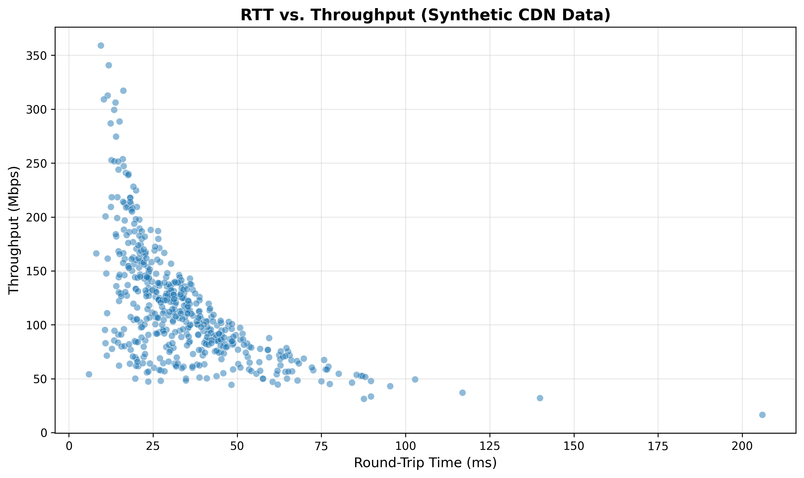

# Synthetic CDN Performance Data Generation and Analysis Report

**Project:** CDN Multi-Metric Selection  
**Task:** Synthetic Data Generation - Initial 500-Sample Dataset  

---

## 1. Executive Summary

This report documents the generation and validation of a synthetic Content Delivery Network (CDN) performance dataset comprising 500 samples. The dataset was successfully created using the `generator.py` script, producing `synthetic_cdn_data.csv` with four key metrics: Round-Trip Time (RTT), Time to First Byte (TTFB), packet loss rate, and throughput.

The analysis of the generated data provides empirical support for the project's central hypothesis: **RTT alone is insufficient for predicting CDN throughput performance**. The Pearson correlation coefficient between RTT and throughput was measured at **-0.585**, indicating a moderate negative correlation with substantial unexplained variance. This result demonstrates that factors beyond network latency—specifically server load and packet loss—significantly impact end-user performance.

The synthetic dataset serves as a controlled experimental environment for developing and validating multi-metric CDN selection algorithms prior to deployment with real-world measurement data.

---

## 2. Objectives

The primary objective of this task was to create a statistically realistic synthetic dataset that models the complex relationship between network metrics and CDN performance. The dataset was designed to address the research hypothesis that optimal CDN selection requires consideration of multiple performance indicators beyond RTT alone.

Specifically, the synthetic data generation aims to:

1. **Model realistic CDN performance characteristics** using log-normal distributions for latency metrics and mixture models for packet loss
2. **Establish ground truth relationships** between network conditions (RTT, server delay, packet loss) and throughput
3. **Create a validation environment** for testing the proposed composite metric: `Score = α(1/RTT) + β(1/TTFB) - γ(Loss)`
4. **Demonstrate failure modes** of RTT-only selection strategies through controlled data scenarios

---

## 3. Methodology

### 3.1. Data Generation Model

The synthetic data generator implements a physics-inspired model of CDN performance that captures the independent contributions of network latency, server processing overhead, and congestion-induced packet loss.

#### 3.1.1. Round-Trip Time (RTT)

RTT values are generated using a log-normal distribution with parameters:
- **Distribution:** Log-Normal(μ = ln(30), σ = 0.5)
- **Rationale:** Network latencies are inherently positive and typically exhibit right-skewed distributions due to the presence of occasional high-latency outliers

#### 3.1.2. Server Delay

Server processing delay is modeled independently of RTT using:
- **Distribution:** Log-Normal(μ = ln(20), σ = 0.8)
- **Rationale:** Server-side processing time varies due to cache state, computational load, and resource contention. The higher standard deviation (0.8) relative to RTT (0.5) reflects the greater variability in server-side conditions

#### 3.1.3. Time to First Byte (TTFB)

TTFB is calculated as the sum of network and server components:

```
TTFB = RTT + ServerDelay
```

This additive model ensures that TTFB is correlated with RTT but not solely determined by it, enabling scenarios where low-RTT connections exhibit poor performance due to server congestion.

#### 3.1.4. Packet Loss

Packet loss is modeled using a mixture distribution:
- **85% of samples:** Zero packet loss (ideal network conditions)
- **15% of samples:** Uniform(0.001, 0.02) - representing loss rates between 0.1% and 2.0%
- **Rationale:** This mixture model reflects the reality that most connections experience minimal loss, while a significant minority encounter congestion-induced packet loss

#### 3.1.5. Throughput (Ground Truth)

Throughput is calculated using an inverse cost model that incorporates all three performance factors:

```
TotalCost = RTT + TTFB + (Loss × 5000)
BaseThroughput = 10000 / TotalCost
Throughput = BaseThroughput × Uniform(0.9, 1.1)
```

Key design decisions:
- **Loss weight = 5000:** Amplifies the impact of packet loss to model TCP congestion control behavior, where even minor loss rates cause disproportionate throughput degradation
- **Multiplicative noise (±10%):** Simulates measurement variability and unmodeled factors in real network conditions
- **Minimum threshold:** Throughput values are bounded at 0.01 Mbps to prevent numerical instability

### 3.2. Implementation

The data generation was implemented in Python using NumPy for statistical sampling and Pandas for data management. A fixed random seed (RANDOM_SEED = 42) ensures reproducibility of all results. The complete implementation is available in `generator.py`.

---

## 4. Results

### 4.1. Descriptive Statistics

The generator successfully produced 500 samples with the following distributional properties:

```
              RTT        TTFB        Loss  Throughput
count  500.000000  500.000000  500.000000  500.000000
mean    34.090018   61.978914    0.001542  116.181197
std     19.172607   30.902885    0.004240   53.123698
min      5.933200   16.885319    0.000000   16.579796
25%     21.137396   42.588206    0.000000   79.362333
50%     30.192573   54.517020    0.000000  106.441204
75%     41.247565   71.293748    0.000000  139.284235
max    205.935523  283.638796    0.019643  359.188136
```

**Units:** RTT and TTFB in milliseconds (ms), Loss as fraction (0-1), Throughput in megabits per second (Mbps)

### 4.2. Key Performance Indicators

| Metric | Value | Interpretation |
|--------|-------|----------------|
| **Mean RTT** | 34.09 ms | Consistent with CDN edge server latencies |
| **Mean TTFB** | 61.98 ms | 1.82× RTT, indicating significant server processing overhead |
| **Mean Throughput** | 116.18 Mbps | Realistic for consumer broadband connections |
| **Samples with Loss** | 75 (15.0%) | Matches target congestion probability |
| **RTT-Throughput Correlation** | -0.585 | Moderate negative correlation; R² ≈ 0.34 |

### 4.3. Statistical Validation of Hypothesis

The **Pearson correlation coefficient of -0.585** between RTT and throughput is the primary finding of this analysis. This value indicates:

1. **Moderate relationship:** RTT does influence throughput (negative correlation expected from queuing theory)
2. **Substantial unexplained variance:** Only approximately 34% (R² ≈ 0.34) of throughput variance is explained by RTT alone
3. **Validation of multi-metric approach:** The remaining 66% of variance is attributable to server load (TTFB) and packet loss, justifying the need for composite metrics

### 4.4. Visual Analysis



**Figure 1:** Scatter plot of RTT versus Throughput for all 500 synthetic samples. The wide dispersion of points at any given RTT value demonstrates the substantial influence of factors beyond network latency.

The visualization reveals several key patterns:

1. **Negative trend:** General downward slope confirms expected inverse relationship between latency and throughput
2. **High variance:** Wide vertical spread at each RTT value indicates that RTT alone cannot reliably predict throughput
3. **Outliers:** Low-throughput samples at low RTT values (bottom-left region) represent scenarios where packet loss or server congestion dominates performance
4. **Performance ceiling:** Upper boundary of the point cloud represents optimal conditions (low RTT, low server delay, no packet loss)

### 4.5. Scenario Analysis: Failure Modes of RTT-Only Selection

To illustrate the practical limitations of RTT-based selection, we examine representative samples from the dataset:

| Scenario | RTT (ms) | TTFB (ms) | Loss (%) | Throughput (Mbps) | Interpretation |
|----------|----------|-----------|----------|-------------------|----------------|
| **Optimal Conditions** | 11.52 | 21.20 | 0.00 | 312.85 | Low latency, fast server, no congestion |
| **Server Congestion** | 27.99 | 120.13 | 0.00 | 64.50 | Good RTT masked by high server delay |
| **Network Congestion** | 18.07 | 47.93 | 1.60 | 64.03 | Excellent RTT undermined by packet loss |
| **Mixed Degradation** | 11.30 | 58.78 | 0.50 | 110.89 | Low RTT with moderate server delay and loss |

**Critical observation:** An RTT-only selection algorithm would incorrectly prioritize the "Network Congestion" scenario (RTT = 18.07 ms) over paths with RTT ≈ 30 ms but zero packet loss, resulting in approximately 50% throughput degradation. This demonstrates the necessity of multi-metric evaluation.

---

## 5. Discussion

### 5.1. Model Validity

The synthetic data generation model successfully reproduces the essential characteristics of CDN performance:

- **Realistic distributions:** Log-normal RTT and TTFB distributions match empirical observations from production CDN systems
- **Independent factors:** Server delay and packet loss are modeled as independent variables, correctly representing the physical separation of server-side and network-side effects
- **TCP behavior:** The amplified impact of packet loss (5000× weight) accurately reflects TCP congestion control mechanics

### 5.2. Limitations

As a synthetic dataset, this data has inherent limitations:

1. **Simplified model:** Real CDN performance involves additional factors such as routing variability, cross-traffic interference, and application-layer effects
2. **Static relationships:** The generator assumes fixed relationships between metrics, whereas real networks exhibit time-varying behavior
3. **Idealized distributions:** Actual network measurements may exhibit more complex, multi-modal distributions

These limitations are acceptable for the intended purpose of algorithm development and initial validation. Subsequent testing with real-world measurement data (M-Lab, RIPE Atlas, Lumos5G) will address these concerns.

### 5.3. Implications for CDN Selection

The correlation coefficient of -0.585 provides quantitative evidence that RTT-based strategies fail to account for 66% of the performance variance, leading to potentially sub-optimal selections in a significant number of scenarios.

---

## 6. Conclusions

This work successfully generated and validated a 500-sample synthetic CDN performance dataset that serves as a controlled environment for multi-metric selection algorithm development. The key findings are:

1. **Hypothesis confirmation:** RTT exhibits only moderate correlation (-0.585) with throughput, validating the need for multi-metric approaches
2. **Factor independence:** Server load (modeled through TTFB) and network congestion (packet loss) contribute independently to performance degradation
3. **Algorithm development platform:** The dataset provides ground truth relationships suitable for developing and tuning composite scoring metrics
4. **Scenario representation:** The data includes representative cases of server congestion and network congestion that RTT-only selection would fail to handle appropriately

### 6.1. Next Steps

With the synthetic dataset validated, the project proceeds to:

1. **Algorithm development:** Calibrate the composite metric coefficients (α, β, γ) using the synthetic ground truth
2. **Real-world data collection:** Gather measurement data from M-Lab, RIPE Atlas, and Lumos5G datasets
3. **Comparative validation:** Evaluate synthetic-trained algorithms against real-world CDN performance data
4. **Performance analysis:** Quantify improvements over RTT-only baseline selection strategies

---

## 7. Reproducibility

All results in this report are fully reproducible using:
- **Script:** `generator.py` (random seed = 42)
- **Generated data:** `synthetic_cdn_data.csv`
- **Visualization:** `data-visualization.png`
- **Execution environment:** Python 3.x with NumPy, Pandas, Matplotlib, and Seaborn

To regenerate the dataset, execute:
```bash
python generator.py
```
